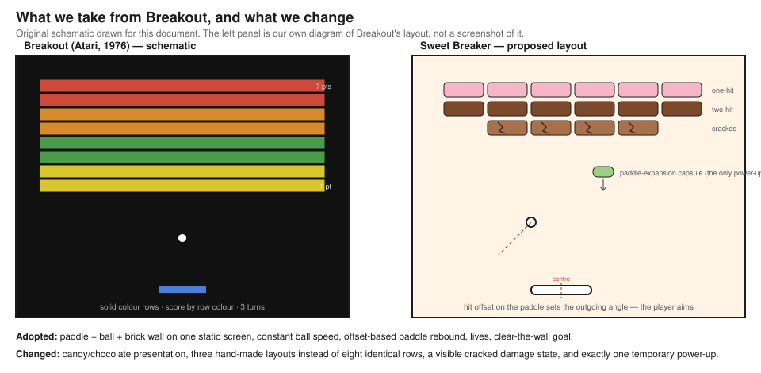
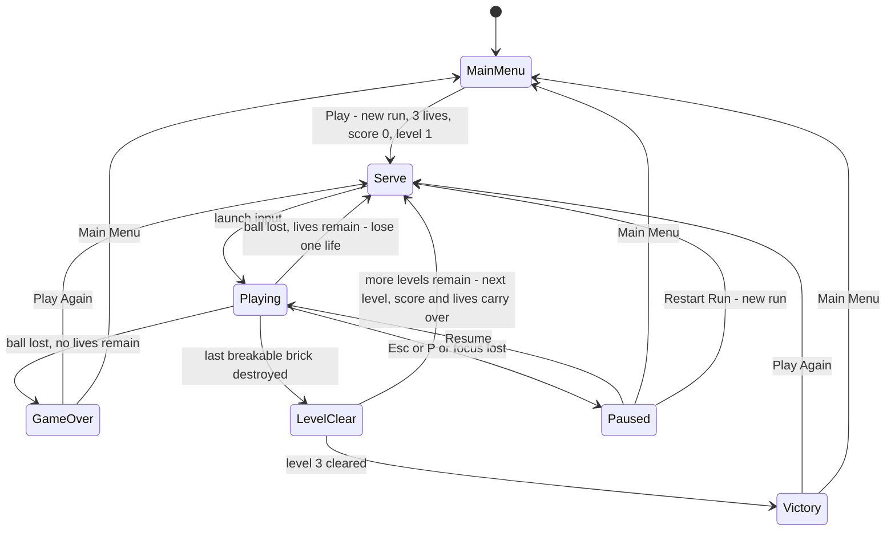
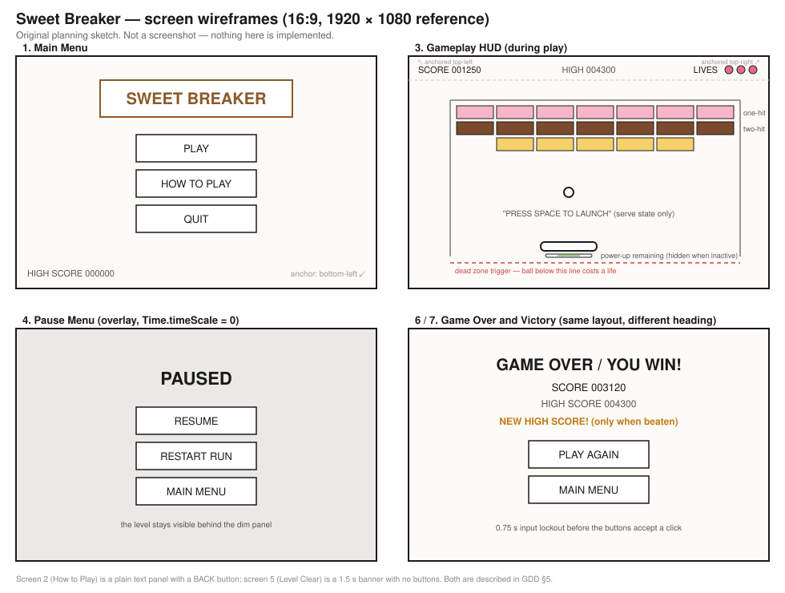
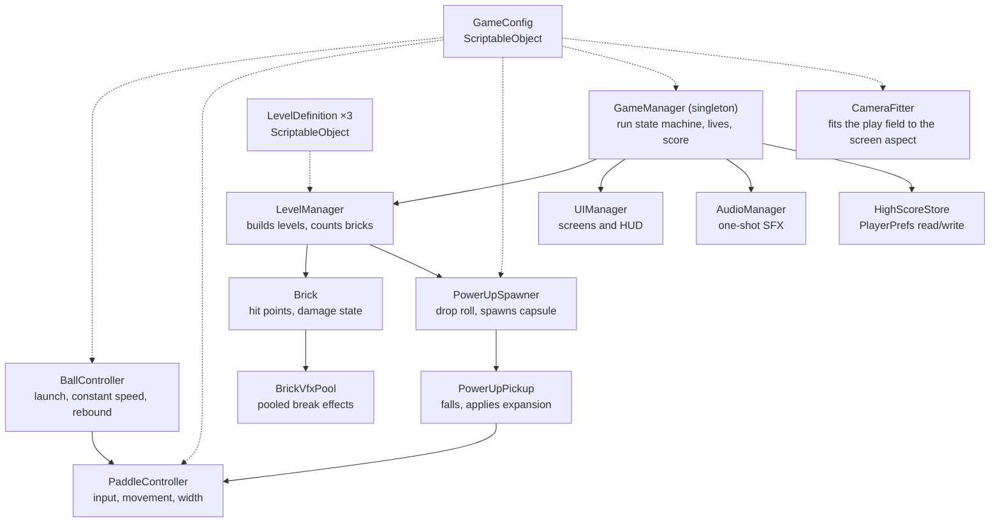

# Game Design Document — *Sweet Breaker*

> **Status: approved by the instructor. Implemented: every MVP and polish item in §8 is built;
> the real Windows-build check at every aspect ratio and the playtest are still to do.**
> Every number below is an initial design estimate, not a measured result.
> **Submission deadline: 2026-10-04.**

| | |
|---|---|
| **Working title** | Sweet Breaker |
| **Team** | Bar Haham (gameplay programming, physics & tuning), Yuval Rauser (UI, levels, audio & art integration) — provisional split, to be confirmed between us |
| **Genre** | Single-player 2D arcade brick-breaker / score-chaser |
| **Target platform** | PC (Windows) standalone build, keyboard + mouse. A mobile build is not required and is not planned. |
| **Engine / Unity version** | Unity **6000.3.20f1** (Unity 6.3 LTS), 2D — the exact version required by the course. No other editor version is used. Render pipeline: URP 2D (the Universal 2D template). |
| **Orientation & reference resolution** | Landscape, 1920 × 1080 reference. Supported aspect ratios: 16:9, 16:10, 4:3 and 21:9 (see §5) |
| **Expected session length** | 3–6 minutes for a full three-level run (initial estimate) |
| **Document version** | v0.7 — 2026-09-26 |

---

## 1. High Concept

The player slides a paddle along the bottom of a single screen and bounces a ball into a wall
of candy and chocolate bricks. One-hit bricks shatter; two-hit bricks crack first. Every brick
broken scores. Miss the ball and lose one of three lives. Clear all three levels to win; lose
every life and the run ends.

*(57 words.)*

### Design pillars

1. **One screen, no surprises.** Everything that decides a rally is on screen at all times: the
   ball, the paddle, the bricks and the walls. This rules out moving or spawning bricks, screen
   scrolling, camera shake big enough to hide the ball (the impact shake in §6 is capped at
   `screenShakeMagnitude`, far inside the camera margin), off-screen hazards, and anything that enters the
   play area from outside the player's view.
2. **Every miss is the player's miss.** The ball's speed is constant and its rebound is a pure
   function of where it struck the paddle — no randomised angles, no speed ramp, no rubber-banding.
   This rules out random ball deflection, per-level speed increases, extra balls, and any power-up
   that changes the ball itself. The one power-up we do keep changes the *paddle*, which the player
   still has to aim with.
3. **Three finished levels beat ten broken ones.** Anything that does not make a three-level run
   feel complete and shippable is cut. This rules out additional power-ups, extra brick types,
   game modes, procedural layouts, unlockables, and a level editor.

---

## 2. Reference & Inspiration

- **Primary reference:** *Breakout* (Atari, 1976) —
  [Wikipedia article](https://en.wikipedia.org/wiki/Breakout_(video_game)).
  **The core mechanic is not ours and we are not claiming it is.** Sweet Breaker is a deliberate
  take on a classic game, which is what the final exercise asks for (Session 6: "Implement your
  take on a Classic Game"; only Flappy Bird and Asteroids are excluded).
  **Taking:** the paddle/ball/brick-wall triangle on a single static screen; a ball whose speed
  never changes; a paddle whose *hit offset* sets the outgoing angle, so the paddle is an aiming
  device rather than a mirror; a fixed pool of lives; clearing the wall as the win condition.
  **Not taking:** score-by-row-colour, the 1976 two-screen structure, the ball-speed-up after a
  set number of hits, and the arcade's paddle-shrink rule.
- **What we change:** presentation (candy and chocolate instead of solid colour bars), level
  design (three hand-authored layouts with deliberate gaps and a two-hit spine, instead of eight
  identical full-width rows), damage feedback (a two-hit brick visibly *cracks* — a different
  sprite, not just a darker tint, so the state is readable mid-rally), and a single temporary
  paddle-expansion power-up where the original has none.
- **Video:** [Arcade Game: Breakout (1976 Atari)](https://www.youtube.com/watch?v=hW7Sg5pXAok) —
  link checked as reachable on 2026-09-13. It shows the rebound behaviour and the pace we are
  aiming for.

**Outstanding submission item.** This section currently carries our own schematic, not a real
reference image. We have deliberately not embedded an Atari *Breakout* screenshot, because we
could not verify a licence that permits redistributing one in this repository. Before submission
we intend to replace it with a screenshot we capture ourselves from a legally playable version,
or with a properly licensed image, and record the source and licence here. Flagged rather than
faked.

---

## 3. Core Game Loop

**This section describes the finished game.** Which parts land in the MVP and which are polish is
settled in §8, not here.

**Moment-to-moment rules** — the things that are true every frame:

- **Paddle movement.** The paddle moves on the horizontal axis only, at a fixed Y. It never
  rotates and never moves vertically. It is a *kinematic* `Rigidbody2D` moved with
  `MovePosition` in `FixedUpdate`; input is sampled in `Update`. Its X is clamped so that the
  paddle's left and right edges stay inside the side walls — the clamp is recomputed whenever the
  paddle width changes, so an expanded paddle cannot be pushed through a wall.
- **Ball launch.** After a serve the ball sits locked to the paddle's centre and moves with it.
  Launch input releases it at `launchAngle` (60° above horizontal) toward the side the paddle was
  last moving; if the paddle is stationary it launches up and to the right. There is no aiming
  preview and no launch-angle control — the serve is always the same shot.
- **Ball speed.** The ball's speed is **set to** `ballSpeed` and re-normalised to `ballSpeed`
  after every collision. Collisions change direction only. This is the single most important rule
  in the document: if bounces are allowed to add or remove energy, the ball either creeps to a
  halt or becomes untrackable, and the game stops being Breakout.
- **Paddle rebound.** The paddle is **not** a mirror. On contact we compute
  `offset = clamp((ball.x - paddle.x) / (paddleWidth / 2), -1, 1)` and send the ball out at
  `offset * maxBounceAngle` degrees from straight up, at `ballSpeed`. Centre hit → straight up;
  edge hit → a shallow 75° shot. This is what turns the paddle into an aiming device and is what
  pillar 2 protects.
- **Wall rebound.** Side and top walls reflect the ball normally (frictionless, fully elastic
  physics material), after which the speed re-normalisation above still applies.
- **Anti-stall.** If the ball's vertical speed stays below `minVerticalSpeedFraction × ballSpeed`
  for longer than `stallTimeout`, its direction is nudged away from horizontal. This exists only
  to prevent an unwinnable horizontal loop between the two side walls.
- **Brick damage.** Each brick has hit points. A one-hit brick is destroyed by its first ball
  contact. A two-hit brick takes its first hit, swaps to its cracked sprite, and is destroyed by
  the second. Damage is applied once per collision event, so a single contact can never take two
  hit points. Bricks never regenerate, and a brick's damage state is not reset by losing a life.
- **Scoring.** Exactly three events award points, and nothing else does:
  - one-hit brick destroyed → **+50**
  - two-hit brick's first (cracking) hit → **+25**
  - two-hit brick's second (destroying) hit → **+75**

  Wall bounces, paddle bounces, power-up pickups, remaining lives and level completion award
  nothing. Score is never reduced. The high score is written only when a run ends (game over or
  victory) and only if the run's score is strictly greater than the stored one.
- **Failure and reset.** A trigger volume below the paddle line is the dead zone. When the ball
  enters it: lives decrease by one, the ball is removed, any active power-up ends immediately and
  the paddle snaps back to its base width, and after `serveDelay` (1.0 s) the paddle is recentred
  and a new ball enters the serve state. Score, brick damage and the level are untouched. If lives
  reach zero the run ends and the Game Over screen appears instead.
- **Level transitions.** A level is clear when the last *breakable* brick is destroyed (unbreakable
  bricks are out of scope entirely — see §8.3 — but the check is phrased as "breakable count == 0"
  rather than "brick count == 0" so the rule states what it means). A 1.5 s "LEVEL n CLEAR" banner plays, then
  the next level's layout is instantiated. **Score carries over. Lives carry over and are not
  refilled.** Any active power-up ends at the transition. After level 3 the run ends in victory.
- **Power-up.** When any brick is destroyed there is a `powerUpDropChance` (15 %) that a
  paddle-expansion capsule spawns at that brick's position and falls at `powerUpFallSpeed`. **At
  most one capsule may exist at a time**, and none spawns while the effect is already active — so
  the player can never be juggling two. Catching it sets the paddle width to
  `paddleWidth × paddleExpandMultiplier` for `powerUpDuration` seconds, timed by a coroutine.
  Catching another capsule while the effect is running **restarts the timer and never stacks the
  width**. A missed capsule falls past the dead zone and is despawned with no penalty. The effect
  is cleared on life loss, on level transition, on restart and on returning to the menu.
- **Pause and restart.** `Esc` or `P` toggles pause during play. Pause sets `Time.timeScale = 0`,
  shows the pause overlay with the level still visible behind it, and pauses audio. Pause is
  ignored outside the Playing and Serve states. "Restart Run" resets score to 0, lives to
  `startingLives`, and the level index to 1, and rebuilds level 1 from its layout prefab.

### Parameters you will need to tune

All values below are **initial design estimates written before anything was built**. They are
first guesses to reach for, not results. Units are Unity world units (u) unless stated.

| Parameter | What it controls | First guess |
|---|---|---|
| `paddleSpeed` | How fast the paddle crosses the screen — the main "can I reach it?" dial | 18 u/s |
| `paddleWidth` | Base paddle width; trades directly against `maxBounceAngle` for how hard aiming is | 2.2 u |
| `paddleExpandMultiplier` | How much wider the power-up makes the paddle | 1.5 × |
| `ballSpeed` | Constant ball speed — the main difficulty dial; changing it always means re-checking `paddleSpeed` | 8 u/s |
| `launchAngle` | Angle above horizontal for the serve | 60° |
| `maxBounceAngle` | Angle from vertical at a full edge hit — how much aim the paddle gives | 75° |
| `minVerticalSpeedFraction` | Below this fraction of `ballSpeed`, the anti-stall nudge kicks in | 0.25 |
| `stallTimeout` | How long a near-horizontal ball is tolerated before the nudge | 1.5 s |
| `startingLives` | Lives at the start of a run | 3 |
| `powerUpDropChance` | Probability that a destroyed brick drops the capsule | 0.15 |
| `powerUpFallSpeed` | How fast the capsule falls — how much reaction time the player gets | 3 u/s |
| `powerUpDuration` | How long the expanded paddle lasts | 8 s |
| `serveDelay` | Pause after losing a life before the next serve (also the input lockout) | 1.0 s |
| `levelClearDelay` | How long the "LEVEL CLEAR" banner holds | 1.5 s |
| `scoreOneHitBreak` / `scoreTwoHitCrack` / `scoreTwoHitBreak` | The three scoring events | 50 / 25 / 75 |
| `playFieldSize` | Width × height of the walled play area, walls included; the camera always fits all of it (§5) | 16 × 10 u |
| `hudBandHeight` | Strip at the top of the play field that the HUD sits over; no brick is placed in it | 1 u |
| `hitStopDuration` | How long the game freezes on a brick break — the weight of the hit | 0.05 s |
| `screenShakeDuration` | How long the camera shakes after a break | 0.12 s |
| `screenShakeMagnitude` | How far the camera moves while shaking; capped so the play field never leaves the view | 0.15 u |
| `paddleSquashDuration` | How long the paddle squashes after the ball hits it | 0.10 s |
| `lastBrickSlowMoScale` | Time scale while the final brick of a level is being cleared | 0.35 |
| `lastBrickSlowMoDuration` | How long that slow motion lasts, in real seconds | 0.8 s |

**Where these live:** a `GameConfig` ScriptableObject asset holds everything in the table, so the
whole feel can be re-tuned without touching a prefab or recompiling (Session 6's motivation for
ScriptableObjects: the data should not be bound to the GameManager prefab). Per-level values that
genuinely differ between levels live on a `LevelDefinition` ScriptableObject instead. Anything that
is truly local to one component — the dead-zone Y, for instance — stays a `[SerializeField]` on
that component.

**Feel target (for future playtesting, not a claim):** we will put the build in front of five
classmates who have not seen it. The target is that **at least three of them clear level 1 within
their first three runs**, and that nobody reports losing a life to a ball they could not physically
reach at `paddleSpeed`. If either fails, `ballSpeed` and `paddleSpeed` are the first two knobs.

---

## 4. Controls & Input

| Action | Keyboard / Mouse | Gamepad | Touch |
|---|---|---|---|
| Move paddle | `A` / `D` or `←` / `→`; or move the mouse (paddle follows cursor X) | Not planned | Not planned — no mobile build |
| Launch ball | `Space` or Left Mouse Button | Not planned | Not planned |
| Pause / resume | `Esc` or `P` | Not planned | Not planned |
| Confirm menu button | `Enter` or Left Mouse Button | Not planned | Not planned |
| Quit game | Quit button on the main menu only — never a hotkey | Not planned | Not planned |

- Input is read on **press** in `Update` and applied in `FixedUpdate`, so no input is dropped
  between physics steps. Keyboard and mouse control are both live: whichever moved last owns the
  paddle, so switching mid-rally does not fight itself.
- **Pressing launch while the cursor is over a UI button:** the UI consumes the click. During the
  Serve state the launch prompt is centred in the play area, well away from the HUD corners, so
  this should not come up in practice.
- **After losing a life:** launch input is locked out for `serveDelay` (1.0 s), so the panicked
  spacebar press that follows a miss does not immediately fire the next ball.
- **On the Game Over and Victory screens:** a 0.75 s lockout before the buttons accept input, for
  the same reason.
- **On focus loss:** `OnApplicationFocus(false)` during play auto-pauses the game. Alt-tabbing away
  must never cost a life.
- **Planned input API:** the legacy Input Manager (`Input.GetKeyDown`, `Input.GetAxis`) as taught in
  Session 2 — it is enough for one axis and three buttons. The Unity 6 Universal 2D template enables only the new Input System, so the project sets **Active Input Handling** to **Both** in Player Settings, which keeps these calls working.

---

## 5. Screens & UI

1. **Main Menu** — title "SWEET BREAKER"; buttons **PLAY** (starts a fresh run: score 0, lives 3,
   level 1), **HOW TO PLAY** (opens screen 2), **QUIT** (exits the application; does nothing in the
   editor). The stored high score is shown bottom-left.
2. **How to Play** — a static text panel listing the controls from §4 and the three scoring
   events; one **BACK** button.
3. **Gameplay HUD** — `SCORE` (top-left, anchored top-left), `HIGH` (top-centre), `LIVES` as three
   candy icons that are removed one at a time (top-right, anchored top-right), and a thin
   power-up timer bar under the score that is hidden whenever no power-up is active. During the
   Serve state only, a centred "PRESS SPACE TO LAUNCH" prompt.
   **Deliberately absent from the HUD:** no timer, no combo counter, no level-progress bar, no
   brick counter, no power-up inventory, no pause button drawn on screen. The play area is the
   thing the player is reading; four numbers is the whole HUD.
4. **Pause Menu** — a dimmed overlay with the level still visible behind it; heading "PAUSED";
   buttons **RESUME**, **RESTART RUN**, **MAIN MENU**.
5. **Level Clear banner** — "LEVEL *n* CLEAR" over the cleared field for `levelClearDelay`. No
   buttons, no input; it is a beat, not a screen.
6. **Game Over** — heading "GAME OVER"; final score; stored high score; the line "NEW HIGH SCORE!"
   shown only when this run beat it; buttons **PLAY AGAIN** and **MAIN MENU**.
7. **Victory** — identical layout to screen 6 with the heading "YOU WIN!" and the same two buttons.
   Sharing the layout is deliberate: one prefab, two headings.

- **Canvas setup:** Screen Space – Overlay; `CanvasScaler` set to **Scale With Screen Size**,
  reference resolution **1920 × 1080**, **Match = 0.5**. Every HUD element is anchored to the corner
  it belongs to, not to the centre. This is directly from the Session 7 pitfall list ("Constant
  Pixel Size", "One Resolution Only", "Unanchored UI").
- **Camera and play-field fit.** The UI scaling above does not move the game world, so the camera
  has its own rule. The camera is orthographic and its size is set so that the **whole play field,
  both side walls included, is always visible**:
  `orthographicSize = max(playFieldHeight / 2 + m, (playFieldWidth / 2 + m) / aspect)`, where the
  margin `m` is `screenShakeMagnitude`, so the field stays fully in view while the camera shakes (§6).
  On a wider screen (21:9) the extra width shows background at the sides; on a narrower one (4:3)
  the extra height shows background above and below. The play field is never cropped, which is
  what pillar 1 requires. The fit is recalculated whenever `Screen.width` or `Screen.height`
  changes, so switching between fullscreen and windowed stays correct.
- **HUD band.** The top `hudBandHeight` of the play field holds no bricks, so the corner-anchored
  HUD never covers a brick or the ball's path at any supported aspect ratio.
- **Mouse control at any size.** The cursor position is converted to world space through the
  camera (`ScreenToWorldPoint`), never read as raw pixels, so mouse control of the paddle lines up
  at every resolution.
- **Window mode.** The Windows build opens in **Fullscreen Window** at the desktop's native
  resolution. `Alt+Enter` switches to windowed mode (the Player Settings fullscreen-switch option).
- **Supported aspect ratios.** 16:9, 16:10, 4:3 and 21:9. Each one is checked in a real Windows
  build, not only in the Game view, before submission: the whole play field is visible, the
  background has no empty strips, the HUD sits in its corners, and the menu buttons stay on screen.
- **Text:** TextMeshPro throughout.
- **Which of these are MVP:** screens 1, 3, 6 and 7 (main menu, HUD, game over, victory) are part
  of the MVP in §8.1. Screen 2 (How to Play), screen 4 (Pause) and screen 5 (Level Clear) are
  polish in §8.2, as are the high-score readouts on screens 1, 3, 6 and 7.

---

## 6. Art & Audio

**Visual direction.** A confectionery counter: a warm cream background, bricks drawn as wrapped
candies (pink, mint, lemon — rounded corners, a soft highlight) and chocolate bars (brown, scored
into squares). The ball is a white gumball, the paddle a chocolate bar wrapper. Chocolate bricks
are the two-hit type and candy bricks the one-hit type, so **material reads as toughness** and the
player learns the rule without a tutorial line. A cracked chocolate brick gets a distinct sprite
with a visible fracture and a lighter body — legible at a glance in the middle of a rally, which a
colour tint alone would not be.

**What we actually used.** No asset pack was downloaded. Every sprite and every sound effect is our
own, generated in the editor from simple shapes and synthesised tones, so there is no third-party
licence to track for them. The only third-party asset is the UI font that ships with TextMesh Pro.

| Asset | Variants / frames | Source & licence | Use | Status |
|---|---|---|---|---|
| Candy brick sprite | 3 colours × 1 state | Own art, drawn by `Assets/Editor/SpriteArtGenerator.cs`: a glossy striped candy with crimped wrapper ends | One-hit bricks | Done |
| Chocolate brick sprite | 1 colour × 2 states (intact, cracked) | Own art, same generator: a bar scored into 4 × 2 squares; cracked = lighter body, deep crack showing the inside, and a bitten-off corner | Two-hit bricks | Done |
| Paddle sprite | 1, 9-sliced so the power-up stretches the body and not the ends | Own art, drawn in the editor | Player paddle | Done |
| Ball sprite | 1 | Own art, drawn in the editor | Ball | Done |
| Power-up capsule sprite | 1 | Own art, drawn in the editor | Paddle expansion pickup | Done |
| Background | 1, 2600 × 1400 px (26 × 14 u) | Own art, same generator: a pink gingham counter with a lighter, faintly sprinkled tray under the play field | Play area backdrop | Done |
| Wall tile, life icon, UI panel | 1 each | Own art, drawn in the editor | Walls, HUD lives, buttons and panels | Done |
| Brick-break particle | 1 small burst | Unity built-in particle system, own material and sprite | Break feedback | Done |
| Chocolate / candy shard sprites | 3 white shapes, tinted per brick | Own art, drawn in the editor | Pooled break fragments | Done |
| UI font | Liberation Sans SDF | Ships with TextMesh Pro; SIL Open Font License 1.1, which permits redistribution. Licence file kept in `Assets/ThirdParty/TextMesh Pro/Fonts/` | All screens | Done (not the rounded face we wanted) |
| SFX: paddle bounce, wall bounce, brick crack, brick break, power-up pickup, life lost, level clear, game over | 8 one-shots | Own work, synthesised in the editor from sine, triangle and noise tones | Feedback | Done |
| Music | 1 short loop, menu only | — | Menu ambience | Cut |

**Licence note.** We would rather author the sprites ourselves than inherit a licence we cannot
read — the art here is simple shapes, which makes that realistic. Where we do use third-party
assets, they go in `Assets/ThirdParty/` and nowhere else (Session 7's "messy project" pitfall), and
this table records the source and licence for each one. We will not commit any asset whose licence
we have not actually checked. This is a private student build for coursework; if anything were ever
made public, every unverified asset would be replaced first.

**Technical art rules (planned).** Sprites authored at 100 pixels-per-unit; bilinear filtering
(the style is not pixel art); one `SpriteAtlas` for the whole game; the paddle sprite 9-sliced with
borders set in the Sprite Editor so the power-up changes `Size` and never `Scale` — the Session 7
"no 9-slice" pitfall, which would otherwise smear the paddle's rounded ends. Sorting layers, back
to front: `Background → Bricks → PowerUps → Ball → Paddle → VFX → UI`. Bricks, ball and capsule
carry a soft drop shadow in an 8 px transparent margin, so the sprite is larger than the collider;
the paddle's margin is vertical only, so its 9-sliced width is still exactly the paddle's width.
URP 2D lights sprites, so the scenes' Global Light 2D must target every one of these sorting layers.

**Impact feedback (the game's one showpiece).** Breaking a brick is the action the player repeats
hundreds of times, so it is the one moment worth making expensive-feeling. Four things fire together:

- **Hit-stop.** The game freezes for `hitStopDuration` at the moment of the break. This is what makes
  a hit feel like it landed rather than like the brick simply vanished.
- **Screen shake.** A short decaying camera offset, bounded by `screenShakeMagnitude`. The bound is a
  design rule, not a preference: pillar 1 says the play field is always visible, and the camera fit in
  §5 leaves margin at every supported aspect ratio, so the shake stays inside it.
- **Chocolate shards.** Pooled sprite fragments thrown outward from the break point, which fall under
  gravity and fade. Candy bricks throw bright fragments, chocolate bricks throw dark ones.
- **Paddle squash.** The paddle briefly squashes on the ball's contact, so the rebound reads as a hit
  rather than a teleport.

**Last brick slow motion.** When the last breakable brick of a level is destroyed, time drops to
`lastBrickSlowMoScale` for `lastBrickSlowMoDuration` before the level-clear banner, so the level ends
on a beat instead of stopping dead.

**Interaction with pause.** Pause also sets `Time.timeScale` to 0, so hit-stop and slow motion are
driven by coroutines that use **unscaled** time and restore the time scale through `GameManager`,
never by writing `Time.timeScale = 1` directly. Otherwise a break during the frame the player pauses
would silently un-pause the game.

**Background size rule.** The background must fill the screen at every supported aspect ratio.
With a 16 × 10 u play field, the widest view is 21:9 (about 23.3 × 10 u) and the tallest is 4:3
(16 × 12 u), so the background is authored at **at least 24 × 12 u — 2400 × 1200 px at 100 PPU** —
and centred on the play field. The shake margin from §5 and the shake itself widen what 21:9 can show to about 24.3 u, so
the background we built is 26 × 14 u (2600 × 1400 px), and the camera clears to the same cream
colour as a second guard. The edges are plain enough that the part cropped on a given screen does
not matter.

---

## 7. Technical Design

**Scenes:** two. `MainMenu.unity` and `Game.unity`. The three levels are **prefabs**, not scenes —
`LevelManager` destroys the current layout and instantiates the next one inside `Game.unity`. Two
scenes means one scene-load path to get wrong instead of four, and the HUD and GameManager survive
a level change without any extra work.

**Packages / systems used:** Physics2D (Box2D), UGUI + TextMeshPro, `UnityEngine.Pool`,
`PlayerPrefs`, the legacy Input Manager, the built-in Particle System. No third-party packages are
planned.

**Target device:** a Windows 10/11 laptop, built as a standalone x64 player. The exact demo machine
and its specifications are **to be confirmed**.

**Architecture:**

| Script | Responsibility |
|---|---|
| `GameManager` | Owns the run state machine and the run's lives, score and level index |
| `PaddleController` | Reads input, moves and clamps the paddle, owns its current width and the expansion's timer coroutine |
| `BallController` | Launch, constant-speed enforcement, and the offset-based paddle rebound |
| `Brick` | Hit points, damage-state sprite swap, and reporting its own destruction |
| `LevelManager` | Instantiates the current level layout and raises "level cleared" at zero breakables |
| `PowerUpSpawner` | Rolls the drop chance on a brick's destruction and spawns at most one capsule |
| `PowerUpPickup` | Falls, detects the paddle and tells it to expand; the capsule is gone once caught, so the timer lives on the paddle |
| `DeadZone` | Detects the ball leaving the play area and reports it |
| `CameraFitter` | Sets the camera size so the whole play field fits the current aspect ratio |
| `ImpactFeedback` | Runs the hit-stop, screen shake, paddle squash and slow motion from §6 |
| `UIManager` | Shows and hides the in-game screens and updates the HUD values |
| `MainMenuUI` | The main menu and the How to Play panel |
| `AudioManager` | Plays one-shot SFX on request; it sits on the GameManager object and travels with it |
| `HighScoreStore` | Reads and writes the single high-score integer (a static class) |
| `BrickVfxPool` | Holds and recycles the brick-break particle bursts and shards in two `ObjectPool`s |
| `Shard` | One pooled fragment: falls, spins, fades, then returns itself to the pool |
| `GameConfig` *(SO)* | Holds the tuning values from §3 |
| `LevelDefinition` *(SO)* | Names one level and points at its layout prefab |

### The course features you are implementing

1. **Physics2D** — the ball is a dynamic `Rigidbody2D` with a frictionless, fully elastic
   `PhysicsMaterial2D`; bricks, walls and the paddle are 2D colliders, and the dead zone is a
   trigger. Layers keep ball↔brick and ball↔paddle live while brick↔brick and
   powerup↔brick are switched off in the collision matrix (Session 4). *Why here:* Box2D already
   solves reflection, continuous collision at speed, and contact normals correctly. Hand-rolling
   raycast reflection would cost us a week and buy nothing at 8 u/s. What we *do* write by hand is
   the paddle rebound, because that one is a design rule, not physics.
2. **GameManager singleton** — one instance, created in `MainMenu` and kept with
   `DontDestroyOnLoad`, holding lives, score, level index and the current state. *Why here:*
   `UIManager`, `LevelManager`, `BallController` and `DeadZone` all need the same answer to "are we
   playing, and how many lives are left?", and they live in a scene that is loaded and unloaded. An
   Inspector reference would break on scene load; `FindObjectOfType` is the error-prone alternative
   Session 3 warns about.
3. **Coroutines** — the `serveDelay` countdown after a life is lost, the `levelClearDelay` banner,
   the power-up's `powerUpDuration` timer, and every part of the impact pack in §6: hit-stop,
   the decaying screen shake, the paddle squash and the last-brick slow motion. *Why here:* the power-up in
   particular needs to expire on a wall clock while the rally continues, and a coroutine held in a
   field can be `StopCoroutine`-ed the instant the player loses a life — which is exactly the
   cancel semantics the reset rule in §3 needs. A timer counted down inside `Update` would end up
   duplicated in three scripts.
4. **Object pooling** — the brick-break particle burst **and the chocolate shards** from §6, via
   `UnityEngine.Pool.ObjectPool<T>`; 8 bursts and 48 shards. *Why here:* a level holds roughly 40 bricks and a good rally can destroy
   several within a second, so this is the one object in the game that is created and destroyed
   repeatedly during play — which makes it the honest place for the pattern. We have not profiled
   anything and are not claiming a measured frame-rate win; the pool is cheap, it is the correct
   tool for repeated short-lived effects, and it keeps allocation out of the rally.
5. **ScriptableObjects** — `GameConfig` for the §3 tuning table and one `LevelDefinition` per
   level. *Why here:* Session 6's exact motivation. Tuning numbers bound to the GameManager prefab
   cannot be edited by two people without a merge conflict, and cannot be swapped for an
   experiment. As an asset, either of us can re-tune or add a level without opening a single script.
6. **UGUI + TextMeshPro, and an AudioManager** — the seven screens in §5 and eight one-shot SFX
   played through `PlayOneShot` (Session 5). *Why here:* a brick-breaker with no impact sound reads
   as broken even when it is working; the audio is feedback, not decoration.
7. **PlayerPrefs** — one integer key, `HighScore`, written at the end of a run and only when
   beaten (Session 6). *Why here:* one integer of local state is precisely what PlayerPrefs is for.
   Anything larger would need a real save format, and a save system beyond this single value is
   explicitly out of scope.

Features taught in the course that we are **not** using, and why: Animator state machines (the
brick damage state is a sprite swap and a particle burst — an Animator would be ceremony around two
sprites), the new Input System (one axis and three buttons do not need it), mobile builds and on-screen
controls (not required for this project),
and Addressables or any asset-streaming system (there are three level prefabs).

---

## 8. Scope

### 8.1 MVP — the game is not a game without these

- [x] One complete, playable level
- [x] Paddle movement with clamping to the play area
- [x] Ball with constant speed, launch-from-paddle serve, and offset-based paddle rebound
- [x] One-hit bricks that are destroyed and removed
- [x] Score, and three lives with the life-loss reset
- [x] Main menu, game-over screen, victory screen, and a working restart
- [x] Win when the level is cleared; lose when lives reach zero
- [x] Camera fit and background size rule from §5–§6, with the HUD anchored to its corners
- [ ] A Windows build checked at 16:9, 16:10, 4:3 and 21:9, fullscreen and windowed

### 8.2 Polish — if the MVP is done and playable

- [x] Expand to three hand-designed levels with the carry-over rules from §3
- [x] Two-hit bricks with a distinct cracked damage state
- [x] The single temporary paddle-expansion power-up
- [x] Pause menu
- [x] Sound effects for bounce, crack, break, pickup, life lost and level clear
- [x] Brick-break particle feedback, via the object pool
- [x] The impact pack from §6: hit-stop, screen shake, pooled shards, paddle squash
- [x] Last-brick slow motion on level clear
- [x] Local high score saved with PlayerPrefs

### 8.3 Explicitly out of scope — we are **not** building these

- Multiplayer of any kind, local or online
- Online services, accounts, cloud saves, or an online leaderboard
- Shops, purchases, ads, or any monetisation
- AI-controlled enemies or any moving non-player entity
- Procedural level generation — all three layouts are hand-authored
- A level editor, or any in-game authoring tool
- **Any power-up other than the paddle expansion** — no multi-ball, no sticky paddle, no laser,
  no slow-motion, no extra-life pickup
- Additional brick types beyond one-hit and two-hit — no unbreakable, explosive or moving bricks
- Additional game modes, difficulty settings, endless mode, or a level-select screen
- A save system beyond the single `PlayerPrefs` high-score integer
- Animator-driven animation, cutscenes, story, or dialogue
- A mobile build or touch controls — not required for this project
- A macOS build — the only target is Windows

---

## Changelog

| Version | Date | Change |
|---|---|---|
| v0.1 | 2026-09-13 | Initial proposal, written for instructor review before any implementation. Nothing built yet. |
| v0.2 | 2026-09-16 | Idea approved by the instructor. Applied the instructor's clarifications: submission deadline 2026-10-04, no mobile build required, exact Unity version 6000.3.20f1. Removed the resolved open questions. |
| v0.3 | 2026-09-16 | Following the instructor's note that each platform must adapt to different screen sizes: added the camera-fit rule, HUD band, background size rule, window mode and the list of supported aspect ratios; added `CameraFitter`; moved the screen-size check from Polish into the MVP; stated that macOS is not a target. |
| v0.4 | 2026-09-19 | Unity project created from the Universal 2D template (URP, 6000.3.20f1). Set Active Input Handling to Both so the legacy Input Manager in §4 actually works. |
| v0.5 | 2026-09-25 | Added the impact pack — hit-stop, bounded screen shake, pooled shards, paddle squash and last-brick slow motion — with its tuning parameters, the `ImpactFeedback` script and the pause interaction rule. No gameplay rule changes: scoring, lives, brick damage and the power-up are exactly as approved. Reworded pillar 1 so the bounded shake does not contradict it. |
| v0.6 | 2026-09-25 | Implementation recorded. Every MVP and polish item in §8 is built except the real Windows-build check. Render pipeline settled as URP 2D. The camera-fit formula in §5 now shows the shake margin that §1 and §6 already assumed, and the background is 26 × 14 u to cover it. §6's asset table records the actual sources: all art and sound is our own, and the only third-party asset is TextMesh Pro's Liberation Sans (SIL OFL 1.1); the menu music is cut. §7's table moves the expansion timer from the capsule to the paddle, since the capsule is destroyed when caught, and lists `MainMenuUI` and `Shard`. No gameplay rule changes. |
| v0.7 | 2026-09-26 | Art pass. The sprites are redrawn to match the visual direction in this section (wrapped candies, 4 × 2 chocolate bars with a clearly broken cracked state, a gingham counter with a sprinkled tray) by an editor tool, `SpriteArtGenerator`, so their origin is in the repository. Recorded the drop-shadow margins and the Global Light 2D rule in the technical art rules. No gameplay rule changes. |

---

## Appendix — open items

1. **Reference image.** See §2 — a self-captured or properly licensed *Breakout* screenshot is
   still to be added.
2. **Windows build check.** All four aspect ratios were checked in the editor's Game view at
   1920 × 1080, 1920 × 1200, 1440 × 1080 and 2560 × 1080: the whole field is visible, the
   background fills the screen, the HUD sits in its corners above the top brick row, and the menu
   buttons stay on screen (screenshots in `Docs/images/screenshots/`). The §5 check of a real
   build, fullscreen and windowed, is still to do.
3. **Playtest.** The §3 feel target (five classmates, three runs each) has not been run yet.
