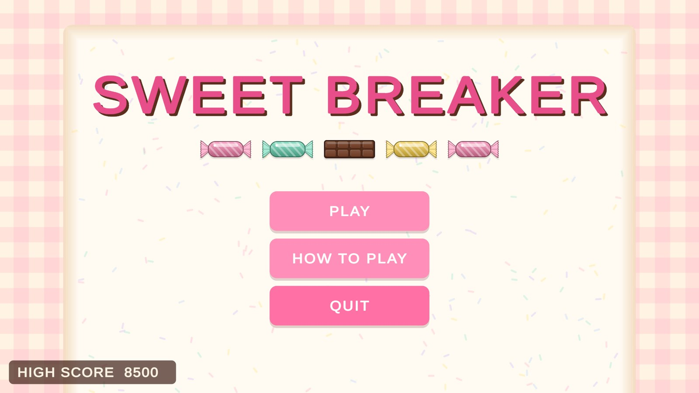
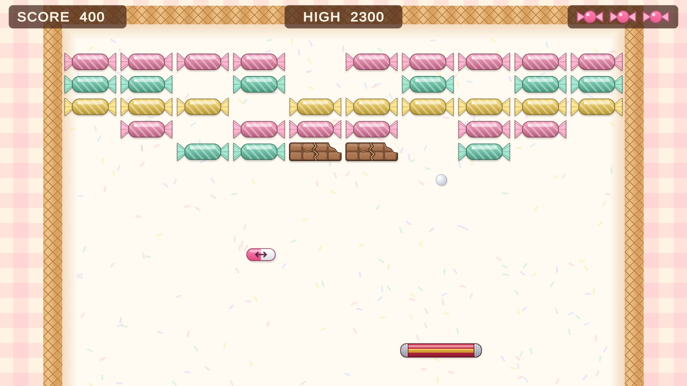
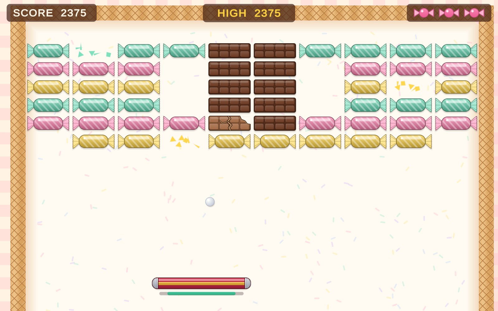
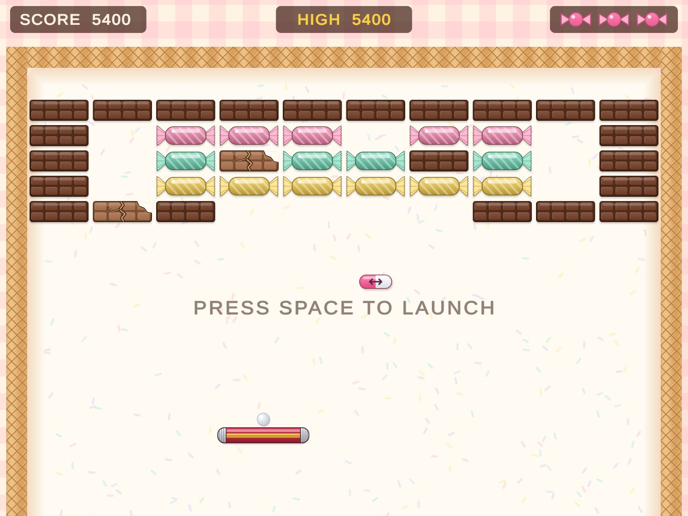
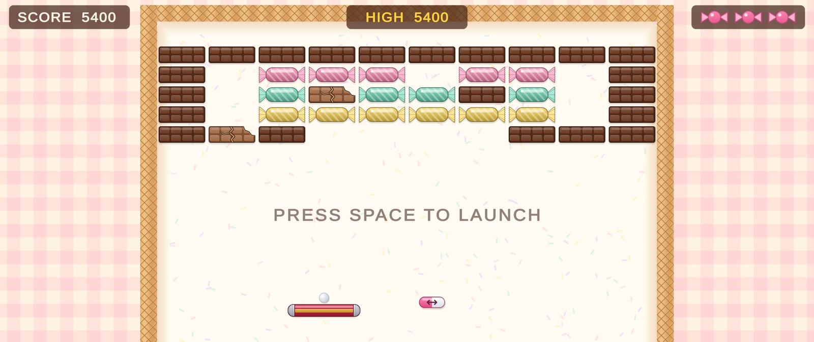
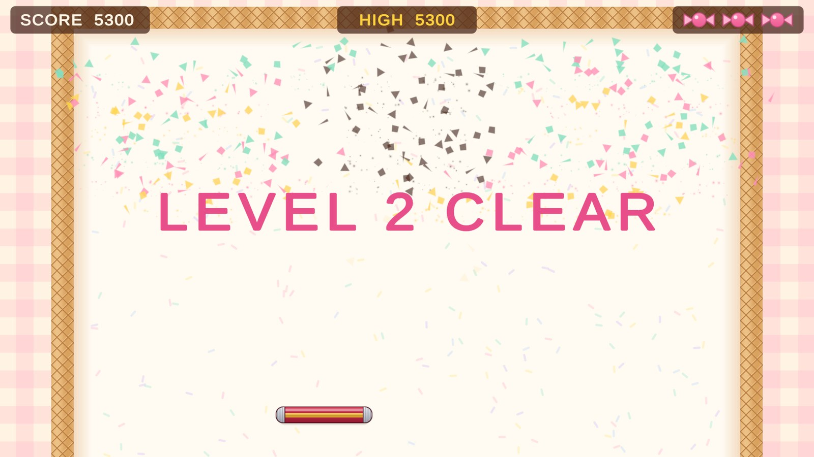
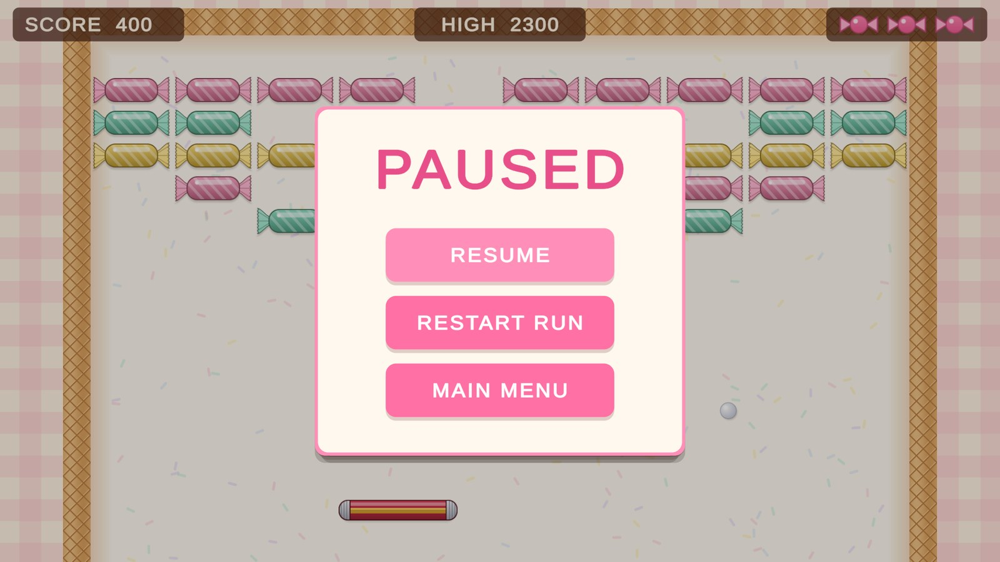
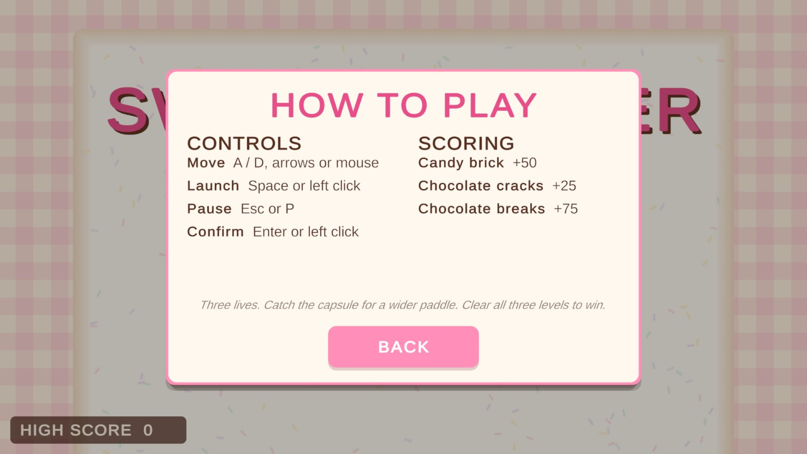
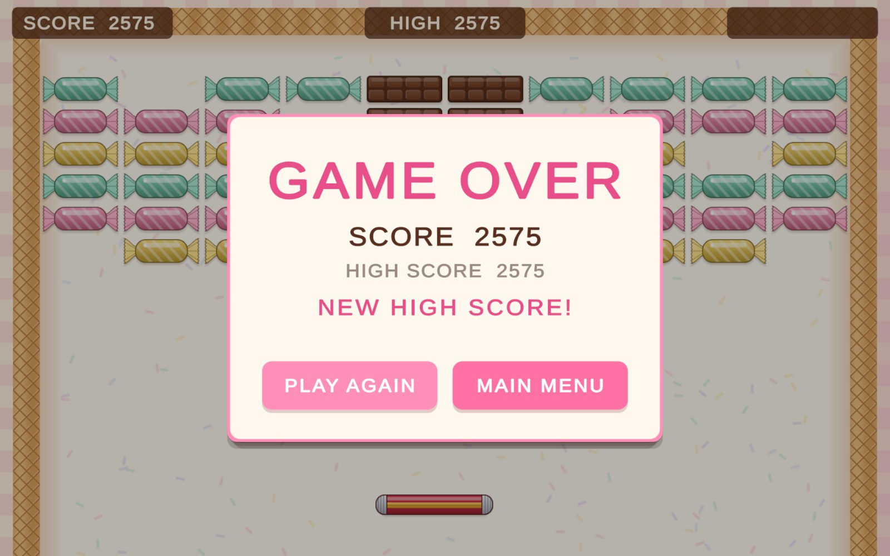
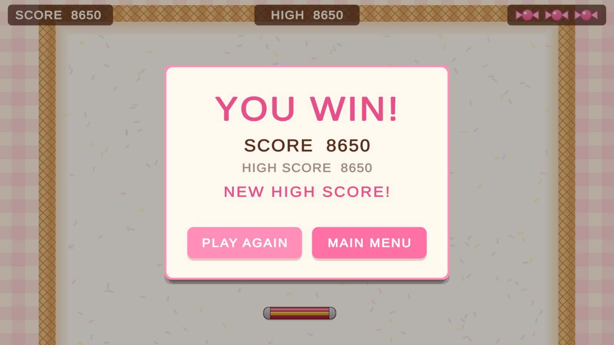

# Sweet Breaker

A single-player 2D arcade brick-breaker. The player slides a paddle along the bottom of one
screen and bounces a ball into a wall of candy and chocolate bricks. Candy breaks on the first
hit; chocolate cracks first and breaks on the second. Missing the ball costs one of three lives,
and clearing all three levels wins the run.

**Status: GDD approved by the instructor. Every MVP and polish feature is built. Still to do:
check a real Windows build at every supported aspect ratio, and playtest.**

Submission deadline: 2026-10-04. Engine: Unity 6000.3.20f1 (URP 2D). Platform: Windows.

## Screenshots

Captured from the running game (Unity Game view) at the resolutions shown.

| | |
|---|---|
|  Main menu |  Level 1 mid-rally, 16:9: both chocolate bars cracked, a capsule falling |
|  Level 2 at 16:10: the wide paddle with its power-up timer underneath, shards from a break, and HIGH turned gold after passing the record |  Level 3 at 4:3 |
|  Level 3 at 21:9 |  The level-clear banner |
|  Pause |  How to Play |
|  Game over |  Victory |

## Running it

1. Open the project folder in Unity **6000.3.20f1** (the exact version the course requires).
2. Open `Assets/Scenes/MainMenu.unity` and press Play. `Game.unity` can also be played on its own;
   it starts a fresh run at level 1.

Active Input Handling is set to **Both** on purpose: the game reads the legacy Input Manager
(`Input.GetKeyDown`, `Input.GetAxisRaw`) as taught in Session 2 (GDD §4).

## Controls

| Action | Keys |
|---|---|
| Move the paddle | `A` / `D`, the arrow keys, or the mouse |
| Launch the ball | `Space` or left click |
| Pause | `Esc` or `P` |
| Confirm a menu button | `Enter` or left click |

## Where the course patterns are

| Pattern | Where | What it does here |
|---|---|---|
| Singleton | [`GameManager`](Assets/Scripts/Core/GameManager.cs) | One run state machine, kept with `DontDestroyOnLoad`; a copy in each scene removes itself if one already exists |
| Coroutines | [`GameManager`](Assets/Scripts/Core/GameManager.cs), [`PaddleController`](Assets/Scripts/Gameplay/PaddleController.cs), [`ImpactFeedback`](Assets/Scripts/Presentation/ImpactFeedback.cs), [`UIManager`](Assets/Scripts/UI/UIManager.cs) | Serve delay, level-clear sequence, the power-up timer, hit-stop, screen shake, paddle squash, last-brick slow motion, end-screen input lockout, the pop when the run passes the high score |
| Object Pool | [`BrickVfxPool`](Assets/Scripts/Presentation/BrickVfxPool.cs), [`Shard`](Assets/Scripts/Presentation/Shard.cs) | `UnityEngine.Pool.ObjectPool` for the brick-break particle bursts (8) and shards (48) |
| ScriptableObjects | [`GameConfig`](Assets/Scripts/Core/GameConfig.cs), [`LevelDefinition`](Assets/Scripts/Core/LevelDefinition.cs) | Every tuning value from GDD §3 in one asset (`Assets/Data/GameConfig.asset`); one asset per level |
| PlayerPrefs | [`HighScoreStore`](Assets/Scripts/Core/HighScoreStore.cs) | The single `HighScore` integer, written only when a run ends and only if beaten |

## Project layout

```
Assets/
  Scripts/Core          GameManager, GameState, GameConfig, LevelDefinition, HighScoreStore
  Scripts/Gameplay      Paddle, Ball, Brick, LevelManager, DeadZone, power-up spawner and pickup
  Scripts/Presentation  CameraFitter, ImpactFeedback, ExpansionTimerBar, BrickVfxPool, Shard
  Scripts/UI            UIManager (in-game screens and HUD), MainMenuUI, MenuFocus
  Scripts/Audio         AudioManager
  Data/                 GameConfig.asset and the three LevelDefinition assets
  Prefabs/              Paddle, Ball, bricks, level layouts, capsule, VFX, UI screens
  Scenes/               MainMenu.unity, Game.unity
  Art/, Audio/          Our own sprites and sound effects
  ThirdParty/           TextMesh Pro essential resources (Liberation Sans, SIL OFL 1.1)
Docs/                   The Game Design Document and its diagrams
```

## Assets and licences

All sprites and all eight sound effects are our own, generated in the Unity editor from simple
shapes and synthesised tones. The sprites come from an editor tool in the repository,
`Assets/Editor/SpriteArtGenerator.cs` (menu: *Sweet Breaker > Regenerate Sprites*). The only third-party asset is the Liberation Sans font that ships
with TextMesh Pro, under the SIL Open Font License 1.1 (licence file in
`Assets/ThirdParty/TextMesh Pro/Fonts/`). Details are in GDD §6.

## Documents

- [Game Design Document](Docs/SWEETBREAKER_GDD.md) — v0.10
- [Docs/images/](Docs/images/) — original diagrams referenced by the GDD

## Team

- Bar Haham
- Yuval Rauser

*(Session 1 allows pairs for the end project. The role split in the GDD is provisional.)*

## Course

Unity 101 for CS Students — Academic College of Tel-Aviv Yaffo, 2026. Final exercise.
